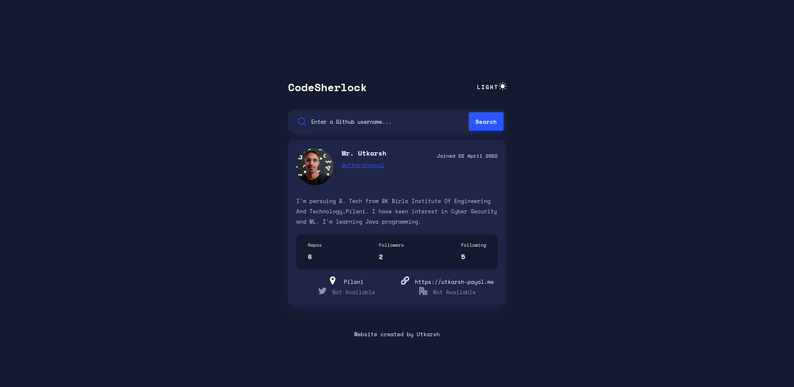

# CodeSherlock

CodeSherlock is a user profile page that interacts with the GitHub API to display information about a user's repositories, followers, following, and more.

## Features

- Search for a GitHub username.
- Display user profile information.
- Show user repositories, followers, and following counts.
- Dark mode toggle.

## Getting Started

To use CodeSherlock, simply enter a GitHub username in the search bar and click "Search."

## Contributing

Feel free to contribute to this project by submitting issues or pull requests.

## Credits

- Website created by [Utkarsh](https://github.com/utkarshpayal).

---

[CodeSherlock](https://github.com/utkarshpayal/CodeSherlock)
